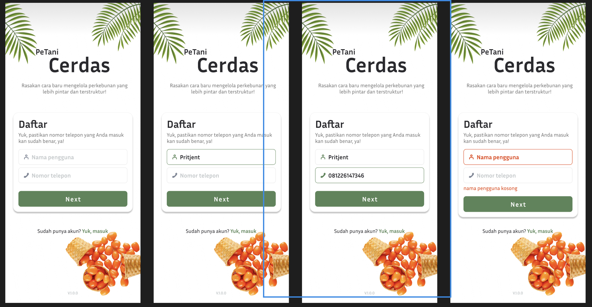

# Petani Cerdas

# About
Proudly to launch 'Petani Cerdas' an app that will help to managing your income outcome of transaction from your farm, help to remind you of the schedule of your farm fertilize or other.

# Tech Stack
By using firebase as the database managing and use so feature of the firebase like Firestore to manage real time database and firebase auth otp to handling the authentication.

On Flutter its self i'm using bloc pattern that get help by bloc to managing the state management to seperate the view and logic. In some case i'm using cubit too to handling state that not really need have so many state.

And there other dependencies that i'm using like flutter_svg, flutter_secure_storage, google_fonts, gap, intl, flutter_launcher_icons, and bcrypt to help me to easly develop the apps.

# Show Of Feature That Done Develop

Auth : 

Transactions :

# Feature UnderDevelop

Calendar : 

Settings :

